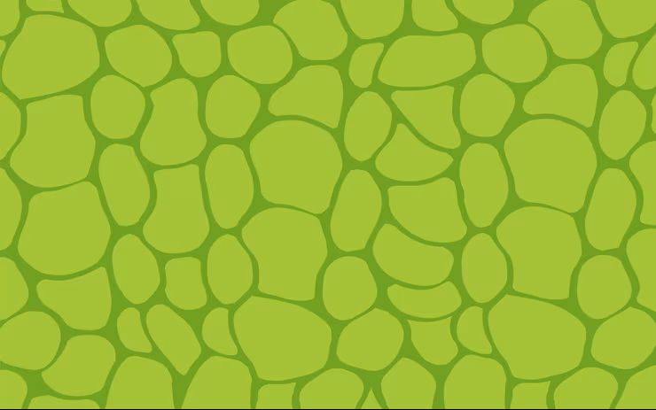

# Autonomous Snake

A Snake game that learns to play itself using **Deep Q-Learning**.

The agent observes the game state, chooses a move, and learns from the outcome. Over time, it improves its ability to find apples and avoid collisions.

## Demo



## How It Works

The agent looks at **11 values** describing the current game state:

- Danger straight ahead
- Danger to the right
- Danger to the left
- Current direction
- Apple position relative to the snake

The neural network then predicts one of **3 possible actions**:

- Go straight
- Turn right
- Turn left

```text
Game State
     ↓
11 Inputs
     ↓
Neural Network
     ↓
3 Possible Actions
     ↓
Snake Environment
     ↓
Next State + Reward
     ↓
Training
```

## Deep Q-Learning

The project uses a simple neural network built with **PyTorch**:

```text
11 Inputs
    ↓
256 Hidden Neurons
    ↓
3 Outputs
```

The model uses:

- Adam optimizer
- MSE loss
- Learning rate: `0.001`
- Discount factor: `0.9`

## Experience Replay

The agent stores previous experiences in a replay memory.

Each experience contains:

```text
(state, action, reward, next_state, done)
```

The replay memory can hold up to **100,000 experiences**.

After each episode, the agent samples from its memory and uses those experiences to train the neural network.

## Training

During training, the program tracks:

- Current score
- Best score
- Average score

Example:

```text
Episode: 100 | Score: 5 | Best: 12 | Avg: 4.32
Episode: 101 | Score: 7 | Best: 12 | Avg: 4.35
Episode: 102 | Score: 10 | Best: 12 | Avg: 4.41
```

Training progress is displayed using **Matplotlib**, showing the score for each episode and the cumulative average.

## Project Structure

```text
.
├── train.py
├── snake_env.py
├── q_network.py
├── visualizer.py
├── snakegameimage.png
└── saved_models/
    └── snake_dqn.pth
```

### `train.py`

Contains the `SnakeAgent` and the main training loop.

### `snake_env.py`

Contains the Snake environment, including movement, collisions, apple spawning, scoring, and rendering.

### `q_network.py`

Contains the PyTorch Q-network and DQN training logic.

### `visualizer.py`

Handles the training progress graph using Matplotlib.

## Installation

Clone the repository:

```bash
git clone https://github.com/your-username/your-repository.git
cd your-repository
```

Install the dependencies:

```bash
pip install torch numpy pygame matplotlib
```

## Running the Project

Start training with:

```bash
python train.py
```

The Snake game and training graph will open while the agent is learning.

The best model is automatically saved to:

```text
saved_models/snake_dqn.pth
```

## Configuration

The main training settings can be changed in `train.py`:

```python
MEMORY_CAPACITY = 100_000
BATCH_SIZE = 1000
LEARNING_RATE = 0.001
```

The discount factor is:

```python
self.gamma = 0.9
```

The neural network uses:

```python
input_dim = 11
hidden_dim = 256
output_dim = 3
```

## Technologies

**Python** • **PyTorch** • **Pygame** • **NumPy** • **Matplotlib**

## Future Improvements

- Improve the neural network architecture
- Experiment with different state representations
- Improve training speed
- Add model evaluation
- Experiment with different DQN approaches
- Add more training visualizations

## License

This project is licensed under the MIT License.
```
